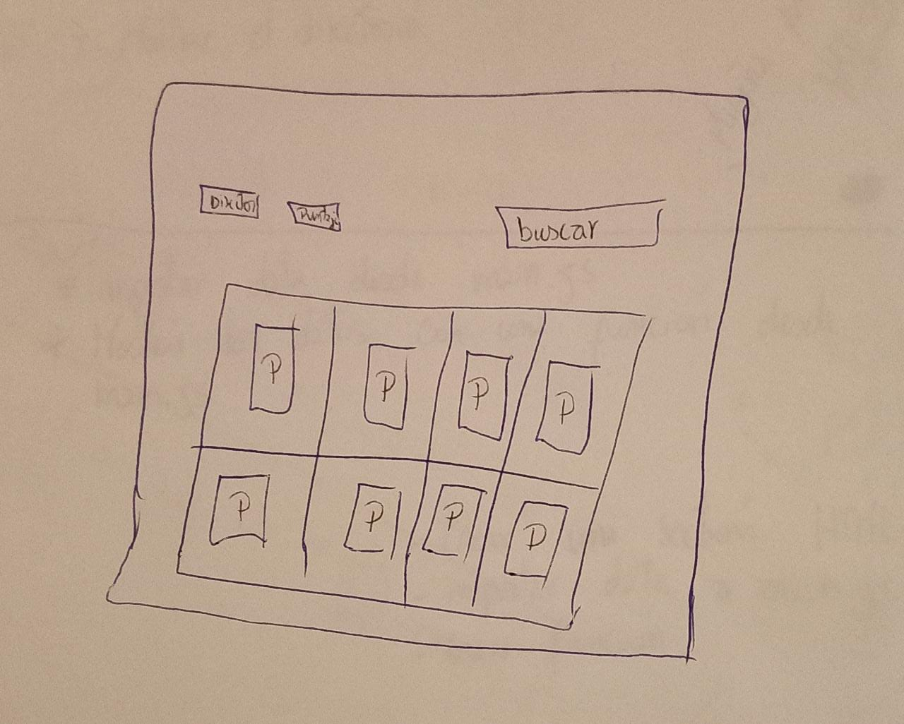
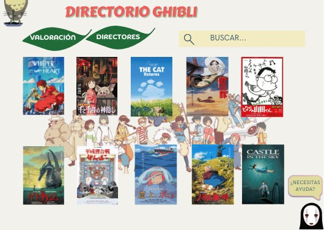
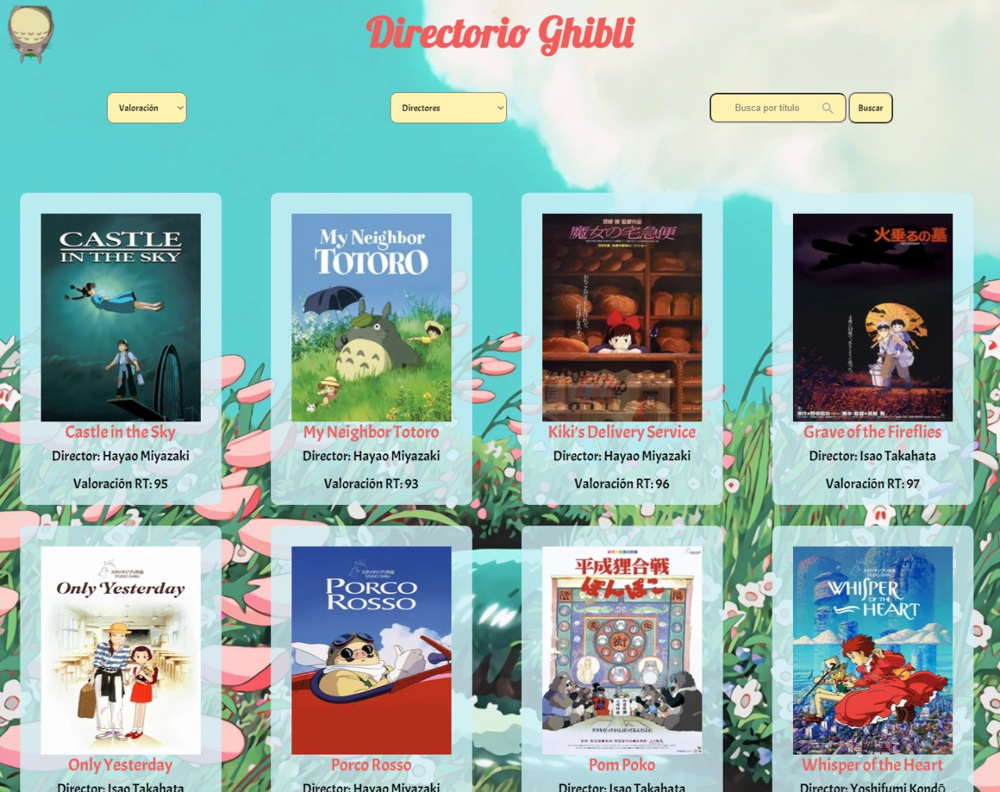
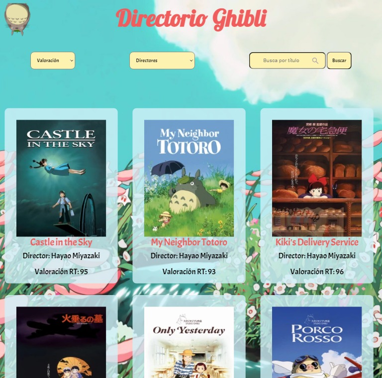
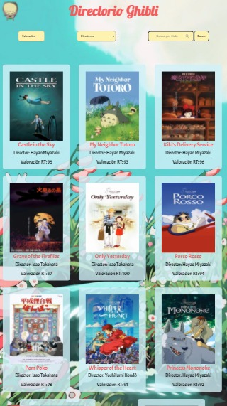

# Data Lovers

## Índice

* [1. Definición del producto](#1-Definición-del-producto)
* [2. Historia de usuaria](#2-Historia-de-usuaria)
* [3. Prototipo de baja fidelidad](#3-Prototipo-de-baja-fidelidad)
* [4. Prototipo de alta fidelidad](#4-Prototipo-de-alta-fidelidad)
* [5. Interfaz en distintos dispositivos moviles](#5-Interfaz-en-distintos-dispositivos-moviles)

***

## 1. Definición del producto

Directorio Ghibli es una página web dirigida a usuarias interesadas en obtener información sobre películas creadas por Studio Ghibli.

Utilizamos un set de datos de Studio Ghibli, del cual seleccionamos información para extraer y visualizar, para que luego la usuaria pueda filtrar y realizar búsquedas en la página web según sus necesidades.

## 2. Historia de usuaria

En base a los resultados obtenidos de la investigación facilitada por Laboratoria, logramos definir las siguientes historias de usuaria para desarrollar la página web:

### HISTORIA DE USUARIA 1
YO COMO: Aficionada de la animación japonesa
QUIERO: Conocer cuáles son las animaciones de Studio Ghibli
PARA: Familiarizarse con las películas de Studio Ghibli

**CRITERIOS DE ACEPTACIÓN**
*La usuaria puede visualizar el directorio de películas de studio Ghibli
*Se muestra cada película con su título, póster, por quien fue dirigida y la puntuación en Rotten Tomatoes

**DEFINICIÓN DE TERMINADO**
*Crear html y css como estructura de la página web
*Extraer la data de las películas e importarla al main.js
*Visualizar la data en la interfaz del directorio

### HISTORIA DE USUARIA 2

YO COMO: Aficionada de Studio Ghibli
QUIERO: Ordenar las películas por valoración en Rotten Tomatoes
PARA: Escoger una película para ver

**CRITERIOS DE ACEPTACIÓN**
*La usuaria puede visualizar una barra de navegación que contiene un menú desplegable 
*La usuaria puede acceder al menú desplegable
*La usuaria puede seleccionar la opción de su preferencia para ordenar las películas de manera ascendente o descendente.

**DEFINICIÓN DE TERMINADO**
*Crear elemento nav que contenga un select con dos opciones seleccionables
*Crear la función de sorting en el data.js
*Ligar la función a un evento ‘change’ en el main.js

### HISTORIA DE USUARIA 3

YO COMO: Fan del Studio Ghibli
QUIERO: Filtrar las películas según director
PARA: Familiarizarse con la filmografía de un director en específico

**CRITERIOS DE ACEPTACIÓN**
*La usuaria puede visualizar una barra de navegación que contiene un menú desplegable
*La usuaria puede desplegar las opciones con los nombres de todos los directores
*La usuaria puede filtrar las películas según director

**DEFINICIÓN DE TERMINADO**
*Agregar un select con los directores al elemento nav creado en el index.html
*Crear la función de filtrado en el data.js
*Ligar la función a un evento el main.js

### HISTORIA DE USUARIA 4

YO COMO: Aficionada de Studio Ghibli
QUIERO: Buscar una película por título
PARA: Visualizar información sobre la película

**CRITERIOS DE ACEPTACIÓN**
*La usuaria puede visualizar una barra de navegación que contiene una barra buscadora
*La usuaria puede tipear el título de su preferencia
*La usuaria puede visualizar las películas filtradas

**DEFINICIÓN DE TERMINADO**
*Se agrega un input tipo search al elemento nav en el index.html
*Se crea la función en el data.js
*Se liga la función a un evento ‘keyup’ en el main.js

## 3. Prototipo de baja fidelidad

## 4. Alta fidelidad

## 5. Interfaz en distintos dispositivos moviles

_Interfaz laptop_

_Interfaz tablet_

_Interfaz celular_

